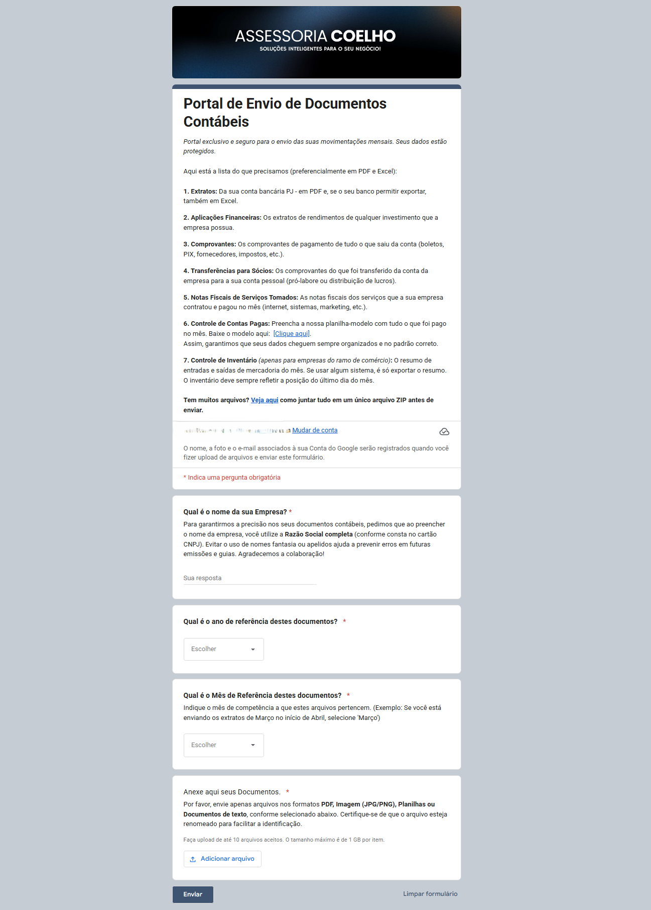
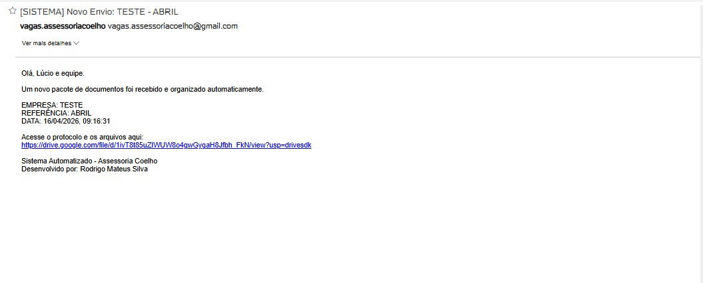
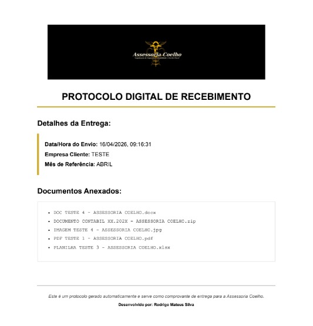
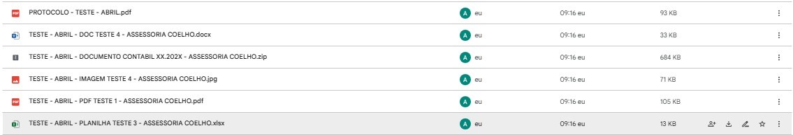
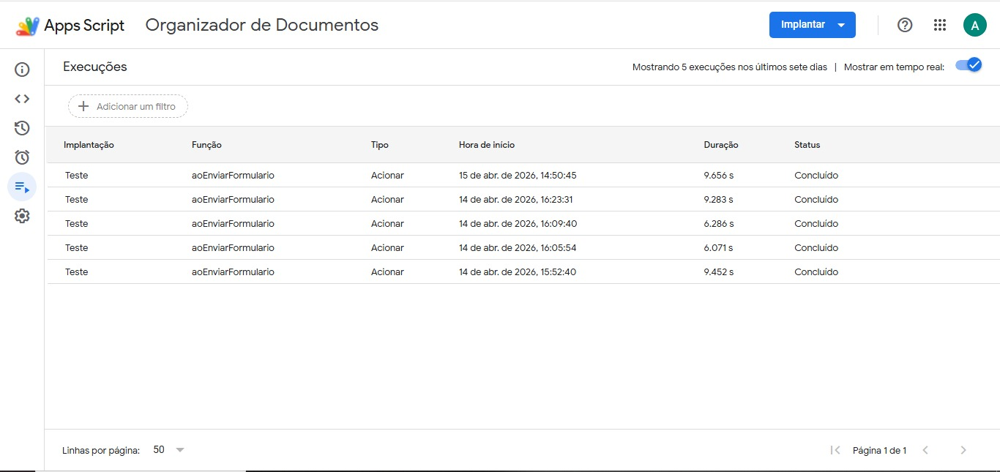

<div style="display: inline-block;">
  
  
  
  
</div>

# Organizador Enterprise 3.2 - Assessoria Coelho

Sistema de automação para recebimento, organização e 
protocolização de documentos contábeis de clientes, 
desenvolvido e implantado em ambiente de produção real.

## Problema resolvido

A Assessoria Coelho recebia documentos contábeis de 
múltiplos clientes de forma desorganizada - por e-mail, 
WhatsApp e outros canais - sem padronização de nomenclatura, 
sem confirmação de recebimento e sem rastreabilidade.

O sistema eliminou esse processo manual, automatizando 
100% do fluxo desde o recebimento até a confirmação.

## Como funciona

```
Cliente preenche o formulário
        ↓
Trigger dispara automaticamente (onFormSubmit)
        ↓
Script identifica empresa e mês de referência
        ↓
Cria estrutura de pastas: /EMPRESA/MÊS/
        ↓
Renomeia arquivos: EMPRESA - MÊS - nome_original
        ↓
Gera PDF de protocolo com logo e lista de documentos
        ↓
Envia e-mail automático com link para o protocolo
```

## Funcionalidades

- Formulário com identidade visual corporativa e 
  instruções detalhadas para o cliente
- Organização automática em hierarquia de pastas 
  por empresa e mês de referência
- Renomeação padronizada de arquivos em lote
- Geração de protocolo em PDF com: logo da empresa, 
  data/hora, nome do cliente, mês e lista de documentos
- Notificação por e-mail automática para a equipe 
  com link direto para os arquivos e protocolo
- Tratamento de erros com log no console

## Tecnologias

- Google Apps Script (JavaScript)
- Google Forms (coleta de dados e upload)
- Google Drive API (organização de pastas e arquivos)
- Gmail API (envio de notificações)
- HTML/CSS (template do protocolo PDF)
- Utilities.newBlob (conversão HTML → PDF)

## Resultado em produção

- Implantado na Assessoria Coelho em abril de 2026
- 5 execuções concluídas com sucesso nos primeiros dias
- Tempo médio de execução: ~8 segundos por envio
- Eliminou processo manual de triagem e organização 
  de documentos de clientes

## Screenshots

### Formulário do cliente


### E-mail automático gerado


### Protocolo PDF gerado


### Estrutura de pastas no Drive


### Log de execuções no Apps Script


## Como replicar

1. Crie um Google Form com os campos:
   - Nome da Empresa (texto)
   - Mês de Referência (lista)
   - Anexar Documentos (upload de arquivo)

2. Abra o Apps Script vinculado ao formulário
   (Extensões → Apps Script)

3. Cole o código de `codigo.gs`

4. Substitua o `idLogo` pelo ID do seu arquivo 
   de logo no Google Drive

5. Configure o trigger:
   - Acionadores → Adicionar acionador
   - Função: `aoEnviarFormulario`
   - Evento: "Ao enviar formulário"

6. Autorize as permissões necessárias e implante

## Autor

Desenvolvido por Rodrigo Mateus Silva  
[linkedin.com/in/rodrigo-mateus-ti](https://linkedin.com/in/rodrigo-mateus-ti)
